<div align="center">


# Shortly — URL Shortener Service

**Production-grade URL shortening with custom aliases, REST API & click analytics**

[](https://python.org)
[](https://flask.palletsprojects.com)
[](https://sqlalchemy.org)
[](LICENSE)

[**Live Demo**](#) · [**API Docs**](#api-documentation) · [**Report Bug**](https://github.com/gagannchandra/shortly-url-shortener/issues)

</div>

---

## Overview

**Shortly** is a full-stack URL shortening service that converts long URLs into clean, shareable links — with optional custom aliases and real-time click analytics. Built with a RESTful Flask backend, SQLite persistence, and a no-framework JavaScript frontend that delivers a smooth single-page feel.

> This project demonstrates end-to-end web service design: REST API architecture, ORM-based data modeling, async JavaScript with the Fetch API, and production-ready error handling — all without any frontend framework bloat.

---

## Screenshots

### 1. Shortening a real GitHub profile URL
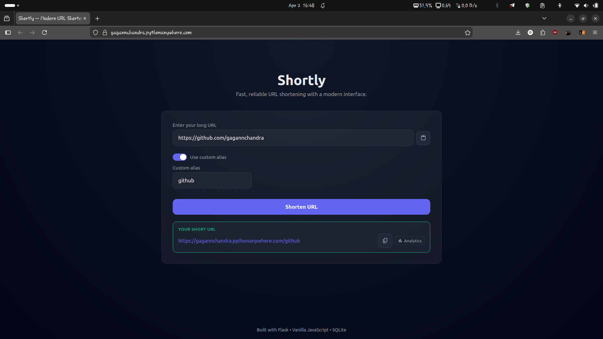

### 2. Validation — Catching an invalid website URL
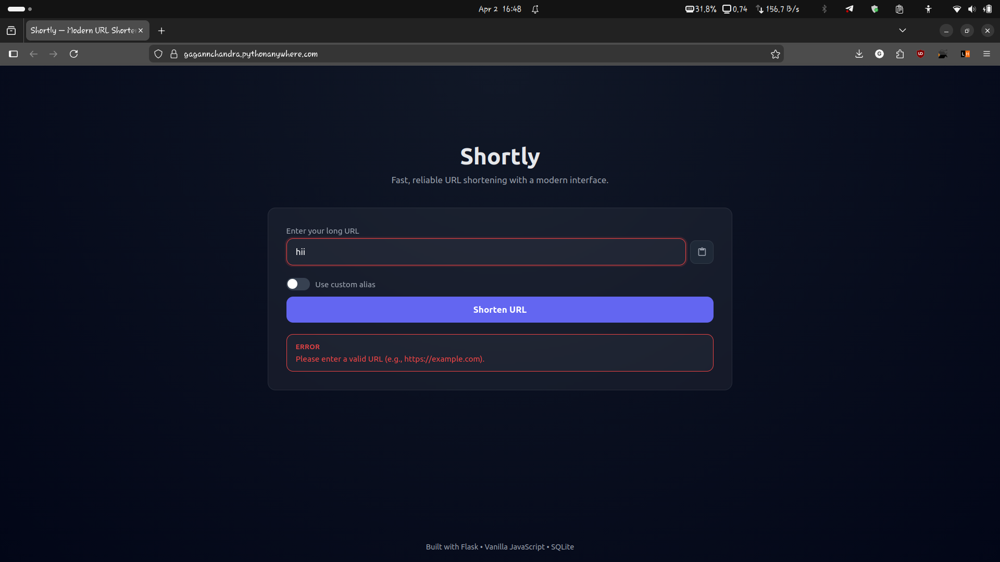

### 3. Normal flow — Shortening a standard URL
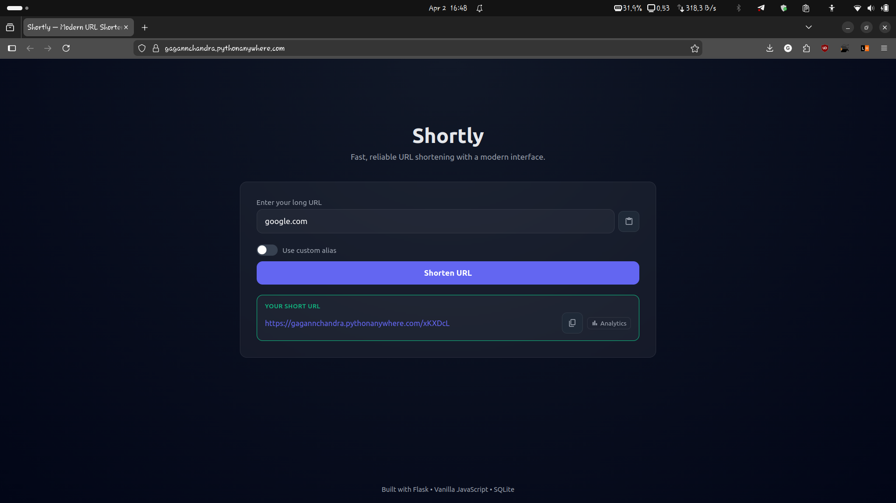

### 4. Custom alias — Branding your short link
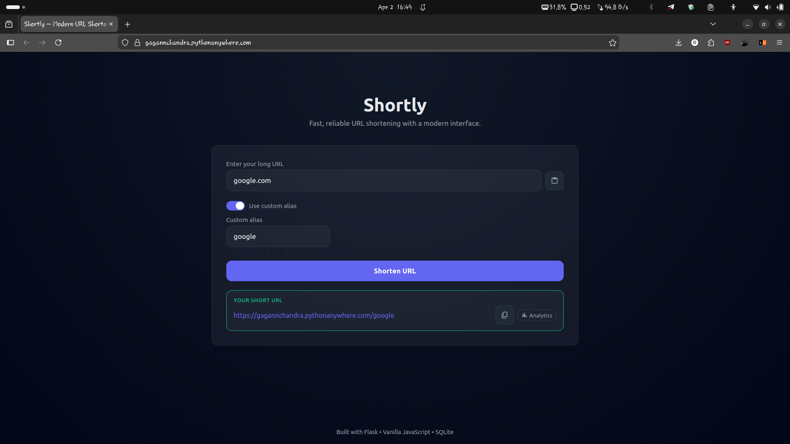

### 5. Alias conflict — Error when alias is already taken
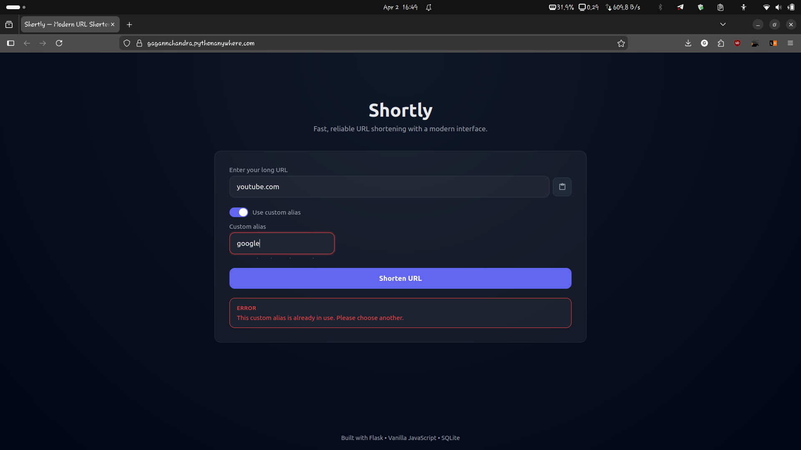

### 6. Validation — Second invalid URL check scenario
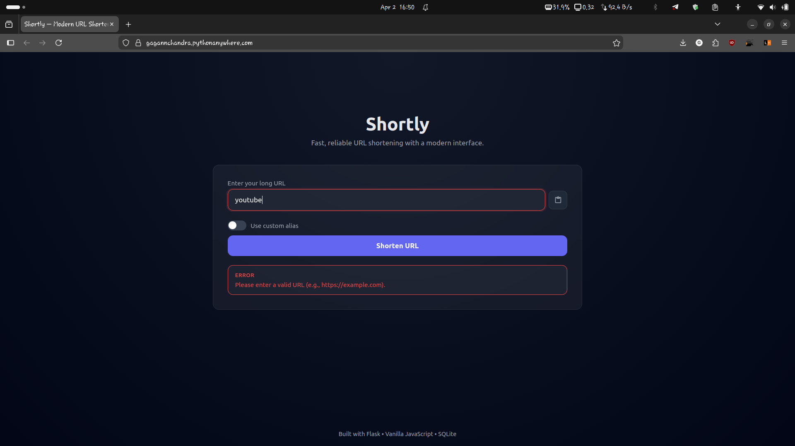

### 7. Normal flow — Another standard shortening example
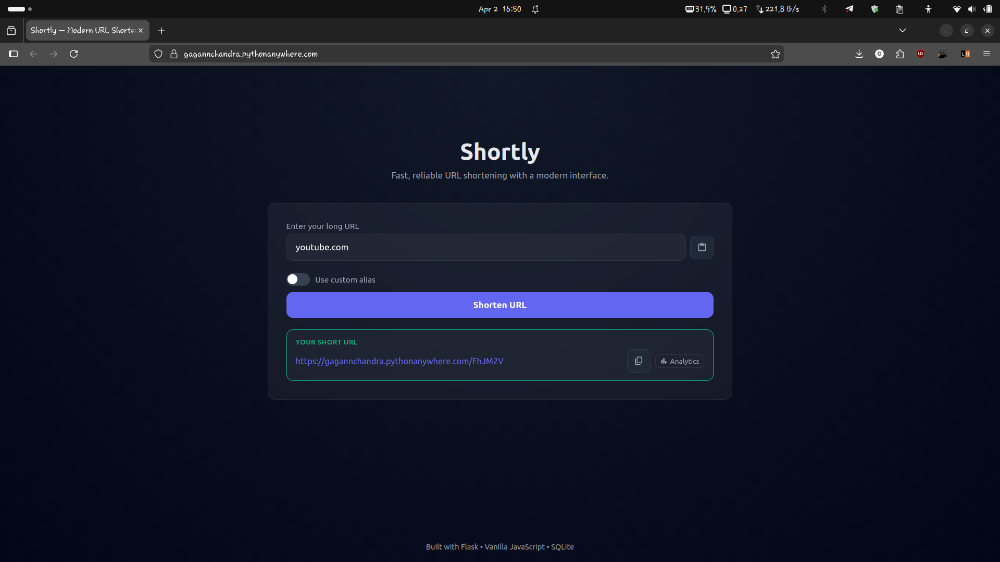

### 8. Link analytics — Tracking clicks on a short link
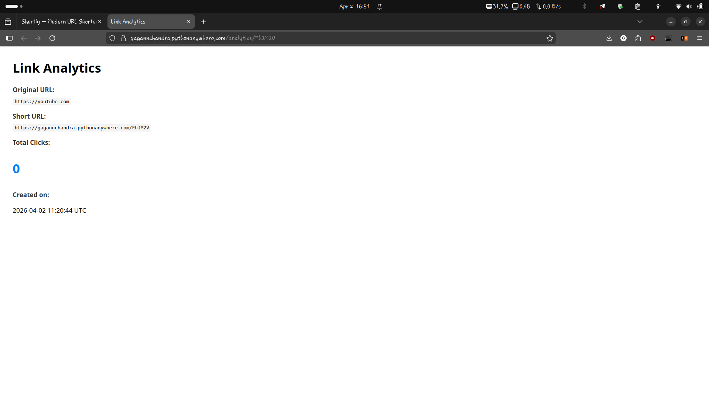

### 9. Link analytics — Updated click count after redirects
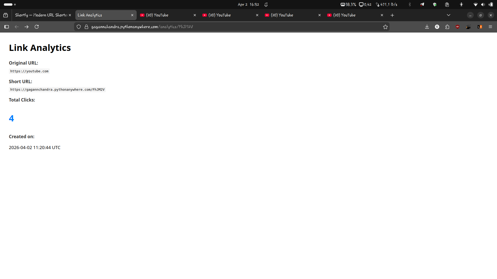

### 10. Custom 404 page — Graceful not-found handling
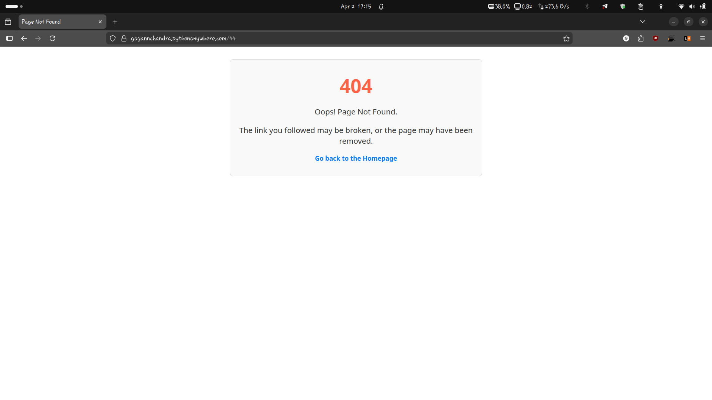

### 11. Custom 500 page — Graceful server error handling
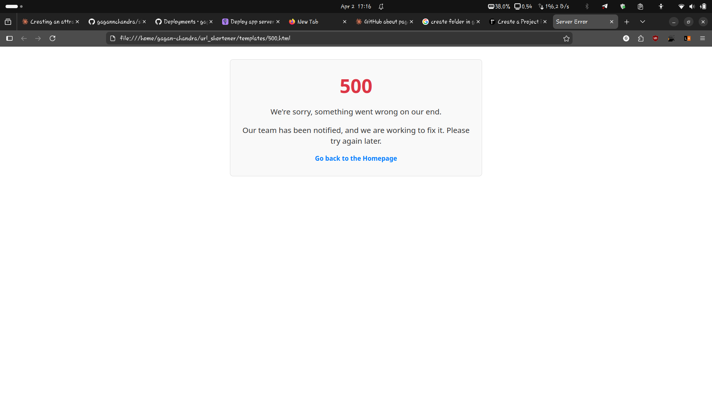

---

## Features

| Feature | Details |
|---|---|
| 🔗 **URL Shortening** | Generates unique random short codes for any valid URL |
| ✏️ **Custom Aliases** | Users can define branded, memorable short links |
| 📊 **Click Analytics** | Per-link click counter with full metadata on a dedicated analytics page |
| 🔌 **REST API** | Clean JSON endpoint (`POST /api/shorten`) for programmatic use |
| ⚡ **No-Reload UI** | Vanilla JS with `fetch` API for a seamless single-page experience |
| 🛡️ **Error Handling** | Custom `404` and `500` pages, input validation, and alias conflict detection |
| 🔒 **Secure Config** | Environment variables via `python-dotenv`; secret key never hardcoded |

---

## Tech Stack

```
Backend     → Python 3.8+, Flask
Database    → SQLite (Flask-SQLAlchemy ORM)
Frontend    → HTML5, CSS3, Vanilla JavaScript (Fetch API)
Config      → python-dotenv
```

---

## Getting Started

### Prerequisites
- Python 3.8+
- Git

### 1. Clone the repository
```bash
git clone https://github.com/gagannchandra/shortly-url-shortener.git
cd shortly-url-shortener
```

### 2. Create and activate a virtual environment
```bash
python -m venv venv

# Windows
venv\Scripts\activate

# macOS / Linux
source venv/bin/activate
```

### 3. Install dependencies
```bash
pip install -r requirements.txt
```

### 4. Configure environment variables

Create a `.env` file in the root directory:
```env
# Generate with: python -c "import secrets; print(secrets.token_hex(24))"
SECRET_KEY='your-secret-key-here'

SQLALCHEMY_DATABASE_URI='sqlite:///urls.db'
```

### 5. Initialize the database
```bash
flask shell
>>> from app import db
>>> db.create_all()
>>> exit()
```

### 6. Run the app
```bash
flask run
```

Visit **http://127.0.0.1:5000** 🚀

---

## API Documentation

### `POST /api/shorten`

Shorten a URL programmatically.

**Request**
```json
{
  "long_url": "https://www.example.com/very/long/path/to/something",
  "custom_alias": "my-link"
}
```
> `custom_alias` is **optional**. Omit it to auto-generate a random short code.

**Success Response — `201 Created`**
```json
{
  "short_url": "http://127.0.0.1:5000/my-link"
}
```

**Error Responses**

| Code | Reason |
|---|---|
| `400 Bad Request` | `long_url` missing or `custom_alias` format is invalid |
| `409 Conflict` | The requested `custom_alias` is already taken |

---

## Project Structure

```
shortly-url-shortener/
├── app.py              # Application factory, routes, models
├── templates/          # Jinja2 HTML templates
│   ├── index.html
│   ├── analytics.html
│   ├── 404.html
│   └── 500.html
├── static/             # CSS and JS assets
├── screenshots/        # App screenshots (9 total)
├── requirements.txt
├── .env.example
└── README.md
```

---

## What I Learned / Key Engineering Decisions

- **ORM over raw SQL** — SQLAlchemy keeps the data layer clean and migration-friendly
- **REST-first design** — Decoupling the API from the UI means the backend can power mobile apps or CLI tools with no changes
- **Environment-based config** — Secrets never touch version control; `.env` pattern is production-ready from day one
- **Graceful error UX** — Custom error pages prevent exposing stack traces and keep the user in the app

---

## License

Distributed under the MIT License. See [`LICENSE`](LICENSE) for details.

---

<div align="center">

Built by [Gagan Chandra](https://github.com/gagannchandra) · B.Tech CSE (AI) · PSIT Kanpur

</div>
